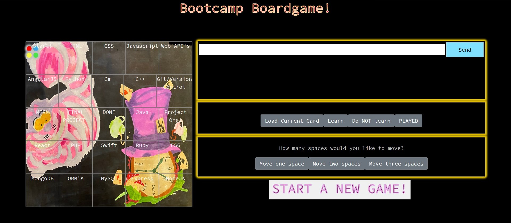

# Coding Bootcamp Boardgame!

## Description
This application is a simple, "Game of Life" style boardgame where up to 4 users (who can be connected locally in a "hot-seat" style gameplay, or remotely in seperate computers) move around the board, make decisions on which technologies to learn, an at the end a result is calculated for each user. The app also includes a chat console for connected users to communicate with each other (across all terminals).

### Game Flow
Users can log into the game in two ways: they can use the authentication page (powered by Auth0 and linked below), or by navigating directly to the game URL. Once all participating users have logged on, click the "Start a New Game" button, which will prompt the users to enter how many players are in the game (1-4). Making this selection will determine the game pawns that are used in the game. 
Users by turn must choose to advance 1,2, or 3 places on the board. Then they should click the "load card" button to display the card corresponding to their current location. Then they should click either the "learn" or "dont learn" buttons. Doing so will either add the technology to the respective user's technologies, or won't). Then they should click the "pass turn" button to pass the turn to the next player across all connected users. Once a user has completed their last turn (reaching the center), they are removed from the turn order.

## Functionality
This application was made using the create-react-app method. It uses functional React with hooks. When a user moves, conditional CSS rendering on the board component shows their location on the board. Clicking the "load card" button sends a GET request to the database API and renders the correct card. Clicking the "learn" button updates the state of the active user to include the technology, and then fires a helper function that updates which user is currently active (with secondary logic allowing for total users in play and if any users have finished the game already). Clicking the "don't learn" button also triggers the same helper function, but without setting state. Clicking the "pass turn" button sends all game information states (all users and game) back to the server using socket.io. On the server side, when information is received by the socket, it is then retransmitted to all connected users. When the front-end receives a socket transmition from the back end, all corresponding state items are updated, making the choices each user makes persistent across terminals. 
There is a standalone chat console that uses the same socket.io technology to allow users to communicate with each other across terminals.

The gatekeeper login was made with Auth0, and is very simple: it allows users to connect, and upon connection redirects them to the actual game URL.

### Technologies, Libraries and API's used
Auth0, React.js, Socket.io, Bootstrap/Reactstrap, MongoDB with Mongoose and mLabs, node.js, express, axios, nodemon, concurrently.

## Deployed links
Auth0 gateway page: https://waterylime.github.io/Login/

Direct game URL: https://radiant-retreat-86258.herokuapp.com/
